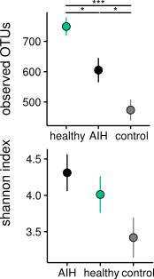
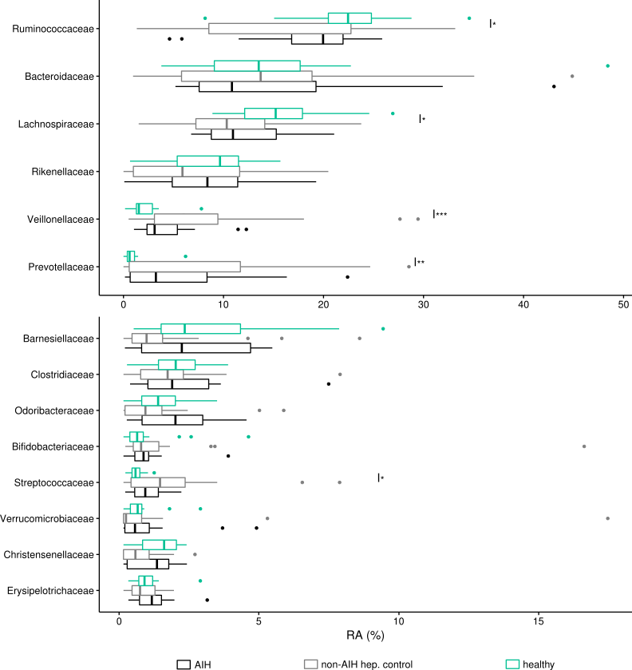
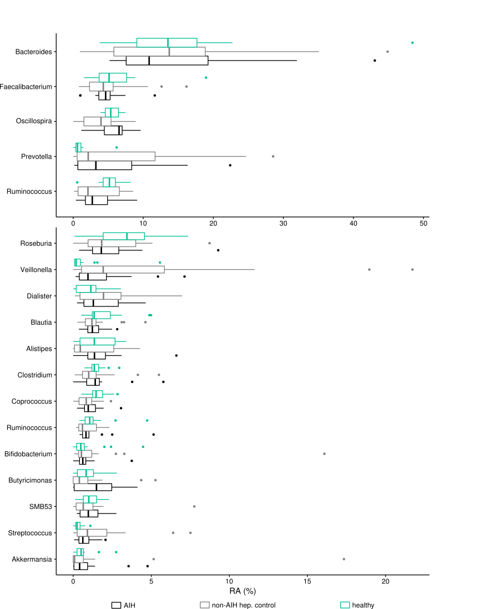
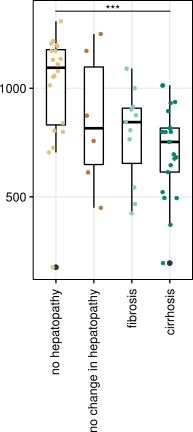

# AIH analysis

## notes

code depends on `metagenomeSeq` and other libraries that must be installed via either Bioconductor or CRAN. Some libraries that were used in this analysis were removed from CRAN e.g. ('biom'). You may need install these libraries (e.g. using `devtools::install_github`) manually to run these scripts.

## data

data which will be used by the scripts is located in the `data/` folder


## figure 1


### figure 1a

alpha diversity

```
soource('figure_1a.R')
```

script generates
- `results/figure_1a_class.pdf`

which was modified manually (using pvalues from supplementary table 2) to create part a of  `ms/version_september_17/figure1.pdf`


### figure 1b

triplot

```
soource('figure_1b.R')
```

script generates
- `results/figure_1b_triplot.pdf`

which was modified to create part b of  `ms/version_september_17/figure1.pdf`

### figure 1c

alpha diversity

```
soource('figure_1c.R')
```

script generates
- `results/figure_1c_chao1.pdf`
- test statistics gets printed to screen:

```
  Tukey multiple comparisons of means
    95% family-wise confidence level

Fit: aov(formula = value ~ type, data = df.adiv)

$type
                     diff       lwr        upr     p adj
control-AIH    -0.2994906 -1.252769 0.65378825 0.7308472
others-AIH     -0.8918631 -1.806463 0.02273673 0.0574292
others-control -0.5923725 -1.463349 0.27860441 0.2384276


```

which was modified manually to create part c of  `ms/version_september_17/figure1.pdf`

## figure 2


### figure 2a

PCOA

```
soource('figure_2a.R')
```

script generates
- `results/figure_2a_print.pdf`
- `results/figure_2a_label.pdf`

which was modified manually to create part a of  `ms/version_september_17/figure2.pdf`

### figure 2b

PCOA contrained by cohort

```
soource('figure_2b.R')
```

script generates
- `results/figure_2b_constrained_by_cohort_print.pdf`
- `results/figure_2b_constrained_by_cohort_label.pdf`

which was modified manually to create part b of  `ms/version_september_17/figure2.pdf`

### figure 2c

PCOA contrained by cohort

```
soource('figure_2c.R')
```

script generates
- `results/figure_2b_constrained_by_liver_print.pdf`
- `results/figure_2b_constrained_by_liver.pdf`
- `results/figure_2b_constrained_by_liver_label.pdf`

which was modified manually to create part c of  `ms/version_september_17/figure2.pdf`


## figure 3


analysis on OTU level

```
soource('figure_3.R')
```

script generates
- `results/figure_3_triplot.pdf`
- `results/figure_3_aih_db.csv`
- `results/figure_3_control_db.csv`
- `results/figure_3_healthy_db.csv`

which was modified manually to create `ms/version_september_17/figure3.pdf`

## supplementary figure 1



```
soource('figure_s1.R')
```

script generates
- `results/figure_s1a_observed.pdf`
- `results/figure_s1b_shannon.pdf`

which was modified manually to create part c of  `ms/version_september_17/figure_s3.pdf`

## supplementary figure 2



```
soource('figure_s2.R')
```

script generates
- `results/figure_s2.pdf`

which was modified manually to create part c of  `ms/version_september_17/figure_s2.pdf`


## supplementary figure 3



```
soource('figure_s3.R')
```

script generates
- `results/figure_s3.pdf`

which was modified manually to create part c of  `ms/version_september_17/figure_s3.pdf`

## unsorted analysis

### correlation of alpha diversity with hep. status




- [figure 5, no groups](results/figure5/figure_5_no_cat.pdf)
- [figure 5, dataset](results/figure5/data.csv)

statistical significance between groups: P = 0.00311

```
            Df  Sum Sq Mean Sq F value  Pr(>F)   
marker       3  920347  306782   5.212 0.00311 **
Residuals   54 3178690   58865                   
---
Signif. codes:  0 ‘***’ 0.001 ‘**’ 0.01 ‘*’ 0.05 ‘.’ 0.1 ‘ ’ 1
```


detailed statistics:

```
  Tukey multiple comparisons of means
    95% family-wise confidence level

Fit: aov(formula = chao1 ~ marker, data = alpha)

$marker
                                                   diff       lwr       upr     p adj
keine_hepatopathie-hepatop_ohne_veraenderung  152.38325 -146.9897 451.75620 0.5361788
mit_fibrose-hepatop_ohne_veraenderung         -67.77229 -394.1865 258.64188 0.9460486
mit_zirrhose-hepatop_ohne_veraenderung       -140.15217 -437.8757 157.57134 0.5995773
mit_fibrose-keine_hepatopathie               -220.15553 -461.5826  21.27157 0.0858399
mit_zirrhose-keine_hepatopathie              -292.53541 -493.4835 -91.58736 0.0016946
mit_zirrhose-mit_fibrose                      -72.37988 -311.7586 166.99883 0.8533967
```


### correlation of alpha diversity with markers

- [figure 6](results/figure6/figure_6.pdf)
- [figure 6 (with mean line)](results/figure6/figure_6_all.pdf)

correlation coefficients will be printed to screen (for chao1, shannon, observed)

shannon

```
> printCorrelationCoef(chao1)
control

	Pearson's product-moment correlation

data:  df.adiv[which(df.adiv$type == "others"), ]$adiv and df.adiv[which(df.adiv$type == "others"), ]$ifap
t = -1.2159, df = 19, p-value = 0.2389
alternative hypothesis: true correlation is not equal to 0
95 percent confidence interval:
 -0.6275839  0.1843826
sample estimates:
       cor 
-0.2686908 


	Pearson's product-moment correlation

data:  df.adiv[which(df.adiv$type == "others"), ]$adiv and df.adiv[which(df.adiv$type == "others"), ]$lbp
t = 0.47462, df = 19, p-value = 0.6405
alternative hypothesis: true correlation is not equal to 0
95 percent confidence interval:
 -0.3392953  0.5158291
sample estimates:
      cor 
0.1082462 


	Pearson's product-moment correlation

data:  df.adiv[which(df.adiv$type == "others"), ]$adiv and df.adiv[which(df.adiv$type == "others"), ]$sCD14
t = -0.96352, df = 19, p-value = 0.3474
alternative hypothesis: true correlation is not equal to 0
95 percent confidence interval:
 -0.5923340  0.2380273
sample estimates:
       cor 
-0.2158375 

healthy

	Pearson's product-moment correlation

data:  df.adiv[which(df.adiv$type == "control"), ]$adiv and df.adiv[which(df.adiv$type == "control"), ]$ifap
t = -0.21226, df = 10, p-value = 0.8362
alternative hypothesis: true correlation is not equal to 0
95 percent confidence interval:
 -0.6171537  0.5271918
sample estimates:
        cor 
-0.06697288 


	Pearson's product-moment correlation

data:  df.adiv[which(df.adiv$type == "control"), ]$adiv and df.adiv[which(df.adiv$type == "control"), ]$lbp
t = -0.72758, df = 10, p-value = 0.4836
alternative hypothesis: true correlation is not equal to 0
95 percent confidence interval:
 -0.7071303  0.4013207
sample estimates:
       cor 
-0.2242239 


	Pearson's product-moment correlation

data:  df.adiv[which(df.adiv$type == "control"), ]$adiv and df.adiv[which(df.adiv$type == "control"), ]$sCD14
t = -0.14956, df = 9, p-value = 0.8844
alternative hypothesis: true correlation is not equal to 0
95 percent confidence interval:
 -0.6308246  0.5670197
sample estimates:
        cor 
-0.04979144 

AIH

	Pearson's product-moment correlation

data:  df.adiv[which(df.adiv$type == "AIH"), ]$adiv and df.adiv[which(df.adiv$type == "AIH"), ]$ifap
t = 0.58046, df = 14, p-value = 0.5708
alternative hypothesis: true correlation is not equal to 0
95 percent confidence interval:
 -0.3705645  0.6031700
sample estimates:
      cor 
0.1533008 


	Pearson's product-moment correlation

data:  df.adiv[which(df.adiv$type == "AIH"), ]$adiv and df.adiv[which(df.adiv$type == "AIH"), ]$lbp
t = 0.70243, df = 14, p-value = 0.4939
alternative hypothesis: true correlation is not equal to 0
95 percent confidence interval:
 -0.3425250  0.6232134
sample estimates:
      cor 
0.1845082 


	Pearson's product-moment correlation

data:  df.adiv[which(df.adiv$type == "AIH"), ]$adiv and df.adiv[which(df.adiv$type == "AIH"), ]$sCD14
t = -2.4767, df = 14, p-value = 0.02664
alternative hypothesis: true correlation is not equal to 0
95 percent confidence interval:
 -0.82259702 -0.07744908
sample estimates:
       cor 
-0.5519635 

all

	Pearson's product-moment correlation

data:  df.adiv[which(df.adiv$type == "AIH" | df.adiv$type == "control" |  and df.adiv[which(df.adiv$type == "AIH" | df.adiv$type == "control" |     df.adiv$type == "others"), ]$adiv and     df.adiv$type == "others"), ]$ifap
t = -2.2723, df = 47, p-value = 0.02769
alternative hypothesis: true correlation is not equal to 0
95 percent confidence interval:
 -0.54738273 -0.03665839
sample estimates:
       cor 
-0.3146119 


	Pearson's product-moment correlation

data:  df.adiv[which(df.adiv$type == "AIH" | df.adiv$type == "control" |  and df.adiv[which(df.adiv$type == "AIH" | df.adiv$type == "control" |     df.adiv$type == "others"), ]$adiv and     df.adiv$type == "others"), ]$lbp
t = -0.54859, df = 47, p-value = 0.5859
alternative hypothesis: true correlation is not equal to 0
95 percent confidence interval:
 -0.3530432  0.2060530
sample estimates:
        cor 
-0.07976532 


	Pearson's product-moment correlation

data:  df.adiv[which(df.adiv$type == "AIH" | df.adiv$type == "control" |  and df.adiv[which(df.adiv$type == "AIH" | df.adiv$type == "control" |     df.adiv$type == "others"), ]$adiv and     df.adiv$type == "others"), ]$sCD14
t = -3.8275, df = 46, p-value = 0.0003892
alternative hypothesis: true correlation is not equal to 0
95 percent confidence interval:
 -0.6805680 -0.2409882
sample estimates:
       cor 
-0.4914704 

```

## supplementary table 2

statistics on class level

```
soource('table_s2.R')
```

script generates
- `results/table_s2_class_aih_vs_control.tsv`
- `table_s2_class_aih_vs_helathy.tsv`
- `table_s2_class_healthy_vs_control.tsv`

which was modified manually to create `ms/version_september_17/Table_S2.xlsx`

### healthy vs. non-AIH hep. control

| Class*                	| logFC 	| t     	| P value  	| FDR      	| B     	| sig. Level 	|
|-----------------------	|-------	|-------	|----------	|----------	|-------	|------------	|
| RF3                   	| 1.47  	| 3.45  	| 0.003716 	| 0.027254 	| -1.92 	|  *         	|
| Opitutae              	| 1.18  	| 1.96  	| 0.083799 	| 0.307263 	| -4.45 	| n.s.       	|
| Deferribacteres       	| 1.03  	| 1.55  	| 0.142350 	| 0.377765 	| -4.80 	| n.s.       	|
| [Lentisphaeria]       	| 0.72  	| 0.87  	| 0.402788 	| 0.579287 	| -5.98 	| n.s.       	|
| Erysipelotrichi       	| 0.37  	| 1.10  	| 0.277168 	| 0.435550 	| -6.44 	| n.s.       	|
| Clostridia            	| 0.33  	| 2.32  	| 0.024737 	| 0.136056 	| -4.48 	| n.s.       	|
| 4C0d-2                	| 0.15  	| 0.30  	| 0.769840 	| 0.865654 	| -6.62 	| n.s.       	|
| Mollicutes            	| 0.11  	| 0.13  	| 0.899250 	| 0.905493 	| -6.62 	| n.s.       	|
| Deltaproteobacteria   	| -0.05 	| -0.12 	| 0.905493 	| 0.905493 	| -6.85 	| n.s.       	|
| Bacilli               	| -0.09 	| -0.27 	| 0.786958 	| 0.865654 	| -7.03 	| n.s.       	|
| Bacteroidia           	| -0.11 	| -0.57 	| 0.572722 	| 0.699994 	| -6.90 	| n.s.       	|
| Alphaproteobacteria   	| -0.18 	| -0.81 	| 0.421300 	| 0.579287 	| -6.73 	| n.s.       	|
| Betaproteobacteria    	| -0.25 	| -1.10 	| 0.276335 	| 0.435550 	| -6.44 	| n.s.       	|
| Verrucomicrobiae      	| -0.36 	| -0.60 	| 0.554026 	| 0.699994 	| -6.71 	| n.s.       	|
| Coriobacteriia        	| -0.43 	| -1.29 	| 0.204429 	| 0.408857 	| -6.20 	| n.s.       	|
| Flavobacteriia        	| -0.49 	| -1.17 	| 0.257856 	| 0.435550 	| -5.86 	| n.s.       	|
| Chloroplast           	| -0.50 	| -1.42 	| 0.166344 	| 0.377765 	| -5.76 	| n.s.       	|
| Actinobacteria        	| -0.62 	| -1.45 	| 0.154523 	| 0.377765 	| -6.02 	| n.s.       	|
| Epsilonproteobacteria 	| -0.93 	| -1.42 	| 0.171711 	| 0.377765 	| -5.54 	| n.s.       	|
| Gammaproteobacteria   	| -1.38 	| -4.05 	| 0.000203 	| 0.002229 	| 0.01  	|  * *       	|
| Deinococci            	| -1.87 	| -2.07 	| 0.073636 	| 0.307263 	| -4.22 	| n.s.       	|
| Fusobacteriia         	| -2.33 	| -6.53 	| 0.000001 	| 0.000022 	| 5.67  	|  * * *     	|

### AIH vs. healthy

| Class*                	| logFC 	| t     	| P value 	| FDR    	| B     	| sig. Level 	|
|-----------------------	|-------	|-------	|---------	|--------	|-------	|------------	|
| Fusobacteriia         	| 1.67  	| 3.39  	| 0.0027  	| 0.0314 	| -1.57 	|  *         	|
| Gammaproteobacteria   	| 1.51  	| 4.28  	| 0.0001  	| 0.0027 	| 1.04  	|  * *       	|
| Synergistia           	| 0.76  	| 0.81  	| 0.4371  	| 0.7733 	| -5.16 	| n.s.       	|
| Verrucomicrobiae      	| 0.44  	| 0.83  	| 0.4101  	| 0.7733 	| -6.00 	| n.s.       	|
| Actinobacteria        	| 0.41  	| 1.08  	| 0.2876  	| 0.7158 	| -5.87 	| n.s.       	|
| Bacteroidia           	| 0.29  	| 1.39  	| 0.1728  	| 0.6025 	| -5.50 	| n.s.       	|
| Coriobacteriia        	| 0.29  	| 1.03  	| 0.3112  	| 0.7158 	| -5.91 	| n.s.       	|
| Betaproteobacteria    	| 0.24  	| 0.94  	| 0.3523  	| 0.7365 	| -5.99 	| n.s.       	|
| Erysipelotrichi       	| 0.23  	| 0.72  	| 0.4743  	| 0.7791 	| -6.18 	| n.s.       	|
| RF3                   	| 0.21  	| 0.41  	| 0.6899  	| 0.8755 	| -5.71 	| n.s.       	|
| Bacilli               	| 0.16  	| 0.56  	| 0.5804  	| 0.8343 	| -6.29 	| n.s.       	|
| Deferribacteres       	| 0.14  	| 0.28  	| 0.7846  	| 0.8755 	| -5.90 	| n.s.       	|
| 4C0d-2                	| 0.13  	| 0.26  	| 0.7980  	| 0.8755 	| -6.06 	| n.s.       	|
| Deinococci            	| 0.11  	| 0.15  	| 0.8809  	| 0.9210 	| -5.61 	| n.s.       	|
| Chloroplast           	| 0.11  	| 0.26  	| 0.7993  	| 0.8755 	| -6.17 	| n.s.       	|
| Epsilonproteobacteria 	| 0.05  	| 0.08  	| 0.9404  	| 0.9404 	| -5.98 	| n.s.       	|
| Clostridia            	| -0.25 	| -1.32 	| 0.1937  	| 0.6025 	| -5.59 	| n.s.       	|
| Flavobacteriia        	| -0.25 	| -0.57 	| 0.5737  	| 0.8343 	| -5.86 	| n.s.       	|
| Mollicutes            	| -0.28 	| -0.38 	| 0.7050  	| 0.8755 	| -6.12 	| n.s.       	|
| Alphaproteobacteria   	| -0.37 	| -1.56 	| 0.1264  	| 0.5814 	| -5.26 	| n.s.       	|
| Deltaproteobacteria   	| -0.45 	| -1.28 	| 0.2096  	| 0.6025 	| -5.55 	| n.s.       	|
| [Lentisphaeria]       	| -1.27 	| -1.83 	| 0.0861  	| 0.4953 	| -4.37 	| n.s.       	|
| Opitutae              	| -1.52 	| -1.99 	| 0.0719  	| 0.4953 	| -4.05 	| n.s.       	|

### AIH vs. non-AIH hep. control

| Class*                	| logFC 	| t     	| P value 	| FDR  	| B     	| sig. Level 	|
|-----------------------	|-------	|-------	|---------	|------	|-------	|------------	|
| RF3                   	| 1.68  	| 2.34  	| 0.04    	| 0.51 	| -4.57 	| n.s.       	|
| Deferribacteres       	| 1.17  	| 0.85  	| 0.42    	| 0.84 	| -4.60 	| n.s.       	|
| Erysipelotrichi       	| 0.60  	| 1.54  	| 0.13    	| 0.63 	| -4.54 	| n.s.       	|
| 4C0d-2                	| 0.28  	| 0.36  	| 0.72    	| 0.92 	| -4.61 	| n.s.       	|
| Bacteroidia           	| 0.18  	| 0.93  	| 0.36    	| 0.84 	| -4.60 	| n.s.       	|
| Gammaproteobacteria   	| 0.14  	| 0.37  	| 0.71    	| 0.92 	| -4.63 	| n.s.       	|
| Clostridia            	| 0.08  	| 0.48  	| 0.64    	| 0.92 	| -4.63 	| n.s.       	|
| Verrucomicrobiae      	| 0.07  	| 0.10  	| 0.92    	| 0.96 	| -4.63 	| n.s.       	|
| Bacilli               	| 0.07  	| 0.17  	| 0.86    	| 0.94 	| -4.64 	| n.s.       	|
| Betaproteobacteria    	| 0.00  	| -0.02 	| 0.98    	| 0.98 	| -4.64 	| n.s.       	|
| Coriobacteriia        	| -0.14 	| -0.44 	| 0.66    	| 0.92 	| -4.63 	| n.s.       	|
| Mollicutes            	| -0.17 	| -0.18 	| 0.86    	| 0.94 	| -4.61 	| n.s.       	|
| Actinobacteria        	| -0.21 	| -0.53 	| 0.60    	| 0.92 	| -4.63 	| n.s.       	|
| Elusimicrobia         	| -0.28 	| -0.19 	| 0.86    	| 0.94 	| -4.60 	| n.s.       	|
| Opitutae              	| -0.34 	| -0.47 	| 0.65    	| 0.92 	| -4.60 	| n.s.       	|
| Chloroplast           	| -0.39 	| -0.76 	| 0.45    	| 0.84 	| -4.61 	| n.s.       	|
| Deltaproteobacteria   	| -0.50 	| -1.07 	| 0.30    	| 0.84 	| -4.59 	| n.s.       	|
| [Lentisphaeria]       	| -0.56 	| -0.79 	| 0.44    	| 0.84 	| -4.60 	| n.s.       	|
| Alphaproteobacteria   	| -0.56 	| -2.17 	| 0.04    	| 0.51 	| -4.45 	| n.s.       	|
| TM7-3                 	| -0.58 	| -0.85 	| 0.42    	| 0.84 	| -4.60 	| n.s.       	|
| Fusobacteriia         	| -0.66 	| -1.29 	| 0.21    	| 0.72 	| -4.58 	| n.s.       	|
| Flavobacteriia        	| -0.74 	| -1.48 	| 0.16    	| 0.64 	| -4.58 	| n.s.       	|
| Epsilonproteobacteria 	| -0.88 	| -1.69 	| 0.10    	| 0.63 	| -4.55 	| n.s.       	|
| Deinococci            	| -1.76 	| -1.69 	| 0.13    	| 0.63 	| -4.59 	| n.s.       	|


## supplementary table 3

statistics on family level

```
soource('table_s3.R')
```

script generates
- `results/table_s3_family_aih_vs_control.tsv`
- `table_s3_family_aih_vs_helathy.tsv`
- `table_s3_family_healthy_vs_control.tsv`

which was modified manually to create `ms/version_september_17/Table_S3.xlsx`


### healthy vs. non-AIH hep. control

| Family*               	| logFC 	| t     	| P value 	| FDR    	| B     	| sig. Level 	|
|-----------------------	|-------	|-------	|---------	|--------	|-------	|------------	|
| Fusobacteriaceae      	| -2.23 	| -5.37 	| 0.00001 	| 0.0004 	| 3.65  	|  * * *     	|
| Prevotellaceae        	| -1.89 	| -3.16 	| 0.00265 	| 0.0212 	| -2.31 	|  *         	|
| Deinococcaceae        	| -1.87 	| -1.81 	| 0.09122 	| 0.2128 	| -4.44 	| n.s.       	|
| Veillonellaceae       	| -1.79 	| -4.70 	| 0.00002 	| 0.0005 	| 2.35  	|  * * *     	|
| Enterococcaceae       	| -1.65 	| -2.98 	| 0.00647 	| 0.0362 	| -2.57 	|  *         	|
| Enterobacteriaceae    	| -1.64 	| -3.45 	| 0.00122 	| 0.0114 	| -1.52 	|  *         	|
| Pasteurellaceae       	| -1.52 	| -3.70 	| 0.00065 	| 0.0090 	| -0.82 	|  * *       	|
| Leuconostocaceae      	| -1.49 	| -1.64 	| 0.12009 	| 0.2495 	| -4.71 	| n.s.       	|
| Micrococcaceae        	| -1.47 	| -2.39 	| 0.02366 	| 0.0780 	| -3.90 	| n.s.       	|
| Staphylococcaceae     	| -1.41 	| -2.61 	| 0.01496 	| 0.0573 	| -3.35 	| n.s.       	|
| Streptococcaceae      	| -1.36 	| -3.11 	| 0.00311 	| 0.0218 	| -2.46 	|  *         	|
| Campylobacteraceae    	| -1.34 	| -1.79 	| 0.08719 	| 0.2123 	| -4.78 	| n.s.       	|
| Gemellaceae           	| -1.30 	| -2.28 	| 0.03212 	| 0.0947 	| -4.03 	| n.s.       	|
| [Paraprevotellaceae]  	| -1.28 	| -2.67 	| 0.01156 	| 0.0498 	| -3.41 	|  *         	|
| Carnobacteriaceae     	| -1.21 	| -3.48 	| 0.00119 	| 0.0114 	| -1.44 	|  *         	|
| Moraxellaceae         	| -1.13 	| -2.29 	| 0.02858 	| 0.0889 	| -4.18 	| n.s.       	|
| [Weeksellaceae]       	| -1.03 	| -1.49 	| 0.15262 	| 0.2849 	| -5.16 	| n.s.       	|
| Rhodobacteraceae      	| -0.93 	| -1.16 	| 0.25988 	| 0.4158 	| -5.61 	| n.s.       	|
| Corynebacteriaceae    	| -0.87 	| -1.66 	| 0.10904 	| 0.2442 	| -5.15 	| n.s.       	|
| Sphingomonadaceae     	| -0.76 	| -2.51 	| 0.01535 	| 0.0573 	| -3.93 	| n.s.       	|
| Eubacteriaceae        	| -0.73 	| -1.21 	| 0.24008 	| 0.3954 	| -5.57 	| n.s.       	|
| Actinomycetaceae      	| -0.70 	| -1.76 	| 0.08416 	| 0.2123 	| -5.35 	| n.s.       	|
| Comamonadaceae        	| -0.66 	| -2.16 	| 0.03542 	| 0.0992 	| -4.62 	| n.s.       	|
| Peptococcaceae        	| -0.61 	| -1.33 	| 0.19561 	| 0.3423 	| -5.56 	| n.s.       	|
| Lactobacillaceae      	| -0.43 	| -0.90 	| 0.37561 	| 0.5535 	| -6.41 	| n.s.       	|
| Coriobacteriaceae     	| -0.43 	| -1.25 	| 0.21907 	| 0.3717 	| -6.13 	| n.s.       	|
| Verrucomicrobiaceae   	| -0.36 	| -0.62 	| 0.53792 	| 0.6148 	| -6.57 	| n.s.       	|
| Bifidobacteriaceae    	| -0.36 	| -0.72 	| 0.47494 	| 0.5811 	| -6.66 	| n.s.       	|
| Caulobacteraceae      	| -0.32 	| -0.69 	| 0.49812 	| 0.5811 	| -6.38 	| n.s.       	|
| Methylobacteriaceae   	| -0.31 	| -0.36 	| 0.72166 	| 0.7924 	| -6.06 	| n.s.       	|
| Pseudomonadaceae      	| -0.29 	| -0.69 	| 0.49613 	| 0.5811 	| -6.46 	| n.s.       	|
| Peptostreptococcaceae 	| -0.24 	| -0.42 	| 0.67333 	| 0.7541 	| -6.69 	| n.s.       	|
| Alcaligenaceae        	| -0.23 	| -0.69 	| 0.49373 	| 0.5811 	| -6.62 	| n.s.       	|
| Desulfovibrionaceae   	| -0.08 	| -0.19 	| 0.84964 	| 0.8811 	| -6.71 	| n.s.       	|
| Oxalobacteraceae      	| -0.02 	| -0.05 	| 0.96040 	| 0.9604 	| -6.91 	| n.s.       	|
| Neisseriaceae         	| 0.04  	| 0.05  	| 0.95947 	| 0.9604 	| -6.15 	| n.s.       	|
| [Tissierellaceae]     	| 0.12  	| 0.25  	| 0.80721 	| 0.8529 	| -6.54 	| n.s.       	|
| [Odoribacteraceae]    	| 0.13  	| 0.30  	| 0.76323 	| 0.8219 	| -6.80 	| n.s.       	|
| [Mogibacteriaceae]    	| 0.23  	| 0.75  	| 0.45851 	| 0.5811 	| -6.62 	| n.s.       	|
| Bacteroidaceae        	| 0.26  	| 0.69  	| 0.49086 	| 0.5811 	| -6.69 	| n.s.       	|
| Clostridiaceae        	| 0.30  	| 0.80  	| 0.42928 	| 0.5811 	| -6.60 	| n.s.       	|
| Erysipelotrichaceae   	| 0.37  	| 1.07  	| 0.29030 	| 0.4394 	| -6.34 	| n.s.       	|
| Dehalobacteriaceae    	| 0.50  	| 0.77  	| 0.44726 	| 0.5811 	| -6.13 	| n.s.       	|
| Bradyrhizobiaceae     	| 0.53  	| 0.81  	| 0.42790 	| 0.5811 	| -5.96 	| n.s.       	|
| Porphyromonadaceae    	| 0.62  	| 1.58  	| 0.12030 	| 0.2495 	| -5.60 	| n.s.       	|
| Victivallaceae        	| 0.72  	| 0.88  	| 0.39199 	| 0.5629 	| -5.86 	| n.s.       	|
| Lachnospiraceae       	| 0.75  	| 2.69  	| 0.00958 	| 0.0483 	| -3.51 	|  *         	|
| Ruminococcaceae       	| 0.80  	| 2.66  	| 0.01036 	| 0.0483 	| -3.58 	|  *         	|
| S24-7                 	| 0.84  	| 1.56  	| 0.12653 	| 0.2531 	| -5.58 	| n.s.       	|
| Turicibacteraceae     	| 0.88  	| 1.48  	| 0.14561 	| 0.2812 	| -5.67 	| n.s.       	|
| Deferribacteraceae    	| 1.03  	| 1.11  	| 0.27826 	| 0.4328 	| -5.20 	| n.s.       	|
| Rikenellaceae         	| 1.12  	| 2.09  	| 0.04174 	| 0.1113 	| -4.81 	| n.s.       	|
| Christensenellaceae   	| 1.14  	| 2.50  	| 0.01643 	| 0.0575 	| -3.89 	| n.s.       	|
| [Cerasicoccaceae]     	| 1.18  	| 1.42  	| 0.17454 	| 0.3153 	| -5.05 	| n.s.       	|
| [Barnesiellaceae]     	| 1.46  	| 3.02  	| 0.00395 	| 0.0246 	| -2.68 	|  *         	|
| no match              	| 1.96  	| 4.38  	| 0.00006 	| 0.0011 	| 1.28  	|  * *       	|

### AIH vs. healthy

| Family*               	| logFC 	| t     	| P value 	| FDR  	| B     	| sig. Level 	|
|-----------------------	|-------	|-------	|---------	|------	|-------	|------------	|
| Succinivibrionaceae   	| 1.98  	| 1.02  	| 0.33    	| 0.62 	| -4.75 	| n.a.       	|
| Prevotellaceae        	| 1.95  	| 3.38  	| 0.00    	| 0.07 	| -1.19 	| n.a.       	|
| Pasteurellaceae       	| 1.53  	| 3.25  	| 0.00    	| 0.07 	| -1.57 	| n.a.       	|
| Dehalobacteriaceae    	| 1.30  	| 2.10  	| 0.05    	| 0.34 	| -3.80 	| n.a.       	|
| Fusobacteriaceae      	| 1.25  	| 2.53  	| 0.02    	| 0.25 	| -3.11 	| n.a.       	|
| Veillonellaceae       	| 1.08  	| 2.90  	| 0.01    	| 0.10 	| -2.35 	| n.a.       	|
| Peptococcaceae        	| 0.79  	| 1.58  	| 0.13    	| 0.49 	| -4.48 	| n.a.       	|
| Streptococcaceae      	| 0.77  	| 2.07  	| 0.05    	| 0.34 	| -4.07 	| n.a.       	|
| Micrococcaceae        	| 0.64  	| 1.09  	| 0.29    	| 0.62 	| -5.11 	| n.a.       	|
| Staphylococcaceae     	| 0.63  	| 1.60  	| 0.12    	| 0.49 	| -4.55 	| n.a.       	|
| Moraxellaceae         	| 0.63  	| 1.62  	| 0.12    	| 0.49 	| -4.61 	| n.a.       	|
| Pseudomonadaceae      	| 0.59  	| 1.37  	| 0.18    	| 0.50 	| -4.95 	| n.a.       	|
| Carnobacteriaceae     	| 0.56  	| 1.47  	| 0.15    	| 0.50 	| -4.92 	| n.a.       	|
| Campylobacteraceae    	| 0.54  	| 0.69  	| 0.50    	| 0.75 	| -5.25 	| n.a.       	|
| [Paraprevotellaceae]  	| 0.51  	| 0.95  	| 0.35    	| 0.62 	| -5.45 	| n.a.       	|
| Comamonadaceae        	| 0.50  	| 1.31  	| 0.20    	| 0.50 	| -5.17 	| n.a.       	|
| Caulobacteraceae      	| 0.46  	| 0.95  	| 0.35    	| 0.62 	| -5.33 	| n.a.       	|
| Enterobacteriaceae    	| 0.44  	| 0.94  	| 0.36    	| 0.62 	| -5.50 	| n.a.       	|
| Verrucomicrobiaceae   	| 0.44  	| 0.83  	| 0.41    	| 0.67 	| -5.60 	| n.a.       	|
| Sphingomonadaceae     	| 0.41  	| 1.29  	| 0.20    	| 0.50 	| -5.22 	| n.a.       	|
| Peptostreptococcaceae 	| 0.37  	| 0.66  	| 0.51    	| 0.75 	| -5.67 	| n.a.       	|
| Actinomycetaceae      	| 0.36  	| 1.11  	| 0.27    	| 0.62 	| -5.42 	| n.a.       	|
| [Weeksellaceae]       	| 0.35  	| 0.59  	| 0.56    	| 0.75 	| -5.35 	| n.a.       	|
| Gemellaceae           	| 0.30  	| 0.62  	| 0.54    	| 0.75 	| -5.40 	| n.a.       	|
| Bifidobacteriaceae    	| 0.30  	| 0.63  	| 0.53    	| 0.75 	| -5.81 	| n.a.       	|
| Coriobacteriaceae     	| 0.29  	| 1.00  	| 0.33    	| 0.62 	| -5.54 	| n.a.       	|
| [Odoribacteraceae]    	| 0.23  	| 0.51  	| 0.61    	| 0.75 	| -5.89 	| n.a.       	|
| Lactobacillaceae      	| 0.23  	| 0.50  	| 0.62    	| 0.75 	| -5.84 	| n.a.       	|
| Erysipelotrichaceae   	| 0.23  	| 0.71  	| 0.48    	| 0.75 	| -5.78 	| n.a.       	|
| Eubacteriaceae        	| 0.18  	| 0.39  	| 0.70    	| 0.79 	| -5.51 	| n.a.       	|
| Deferribacteraceae    	| 0.14  	| 0.27  	| 0.79    	| 0.86 	| -5.51 	| n.a.       	|
| Oxalobacteraceae      	| 0.12  	| 0.34  	| 0.73    	| 0.81 	| -5.93 	| n.a.       	|
| Bacteroidaceae        	| 0.03  	| 0.10  	| 0.92    	| 0.97 	| -6.02 	| n.a.       	|
| Alcaligenaceae        	| 0.02  	| 0.05  	| 0.96    	| 1.00 	| -6.00 	| n.a.       	|
| Clostridiaceae        	| 0.00  	| 0.00  	| 1.00    	| 1.00 	| -6.03 	| n.a.       	|
| Corynebacteriaceae    	| -0.01 	| -0.01 	| 0.99    	| 1.00 	| -5.59 	| n.a.       	|
| Desulfovibrionaceae   	| -0.16 	| -0.43 	| 0.67    	| 0.78 	| -5.80 	| n.a.       	|
| Christensenellaceae   	| -0.20 	| -0.52 	| 0.61    	| 0.75 	| -5.81 	| n.a.       	|
| Rikenellaceae         	| -0.26 	| -0.56 	| 0.58    	| 0.75 	| -5.87 	| n.a.       	|
| Porphyromonadaceae    	| -0.32 	| -0.96 	| 0.34    	| 0.62 	| -5.54 	| n.a.       	|
| Turicibacteraceae     	| -0.33 	| -0.55 	| 0.59    	| 0.75 	| -5.79 	| n.a.       	|
| [Mogibacteriaceae]    	| -0.35 	| -1.10 	| 0.28    	| 0.62 	| -5.42 	| n.a.       	|
| Ruminococcaceae       	| -0.37 	| -1.58 	| 0.12    	| 0.49 	| -4.85 	| n.a.       	|
| Lachnospiraceae       	| -0.39 	| -1.84 	| 0.07    	| 0.48 	| -4.46 	| n.a.       	|
| Rhodobacteraceae      	| -0.39 	| -0.46 	| 0.65    	| 0.77 	| -5.21 	| n.a.       	|
| Bradyrhizobiaceae     	| -0.55 	| -0.89 	| 0.39    	| 0.65 	| -5.14 	| n.a.       	|
| S24-7                 	| -0.62 	| -1.36 	| 0.18    	| 0.50 	| -5.06 	| n.a.       	|
| [Barnesiellaceae]     	| -0.72 	| -1.29 	| 0.20    	| 0.50 	| -5.24 	| n.a.       	|
| [Tissierellaceae]     	| -0.94 	| -1.45 	| 0.16    	| 0.50 	| -4.64 	| n.a.       	|
|                       	| -1.00 	| -2.25 	| 0.03    	| 0.31 	| -3.73 	| n.a.       	|
| Victivallaceae        	| -1.27 	| -1.79 	| 0.09    	| 0.48 	| -4.21 	| n.a.       	|
| [Cerasicoccaceae]     	| -1.52 	| -1.87 	| 0.09    	| 0.48 	| -4.08 	| n.a.       	|

### AIH vs. non-AIH hep. control

| Family*               	| logFC 	| t     	| P value 	| FDR  	| B     	| sig. Level 	|
|-----------------------	|-------	|-------	|---------	|------	|-------	|------------	|
| Succinivibrionaceae   	| 2.37  	| 2.19  	| 0.04    	| 0.63 	| -4.57 	| n.s.       	|
| Dehalobacteriaceae    	| 1.80  	| 2.50  	| 0.02    	| 0.58 	| -4.56 	| n.s.       	|
| no match              	| 0.96  	| 1.92  	| 0.06    	| 0.63 	| -4.52 	| n.s.       	|
| Christensenellaceae   	| 0.93  	| 1.67  	| 0.10    	| 0.63 	| -4.56 	| n.s.       	|
| Rikenellaceae         	| 0.85  	| 1.34  	| 0.19    	| 0.63 	| -4.57 	| n.s.       	|
| [Barnesiellaceae]     	| 0.74  	| 1.22  	| 0.23    	| 0.63 	| -4.58 	| n.s.       	|
| Erysipelotrichaceae   	| 0.60  	| 1.50  	| 0.14    	| 0.63 	| -4.56 	| n.s.       	|
| Turicibacteraceae     	| 0.55  	| 0.75  	| 0.46    	| 0.79 	| -4.60 	| n.s.       	|
| Ruminococcaceae       	| 0.43  	| 1.22  	| 0.23    	| 0.63 	| -4.58 	| n.s.       	|
| [Odoribacteraceae]    	| 0.36  	| 0.74  	| 0.46    	| 0.79 	| -4.61 	| n.s.       	|
| Lachnospiraceae       	| 0.36  	| 1.14  	| 0.26    	| 0.63 	| -4.59 	| n.s.       	|
| Pseudomonadaceae      	| 0.30  	| 0.62  	| 0.54    	| 0.82 	| -4.61 	| n.s.       	|
| Porphyromonadaceae    	| 0.30  	| 0.66  	| 0.51    	| 0.81 	| -4.61 	| n.s.       	|
| Bacteroidaceae        	| 0.30  	| 0.71  	| 0.48    	| 0.79 	| -4.61 	| n.s.       	|
| Clostridiaceae        	| 0.29  	| 0.70  	| 0.49    	| 0.79 	| -4.61 	| n.s.       	|
| S24-7                 	| 0.22  	| 0.40  	| 0.69    	| 0.90 	| -4.61 	| n.s.       	|
| Leptotrichiaceae      	| 0.19  	| 0.19  	| 0.85    	| 0.96 	| -4.60 	| n.s.       	|
| Aerococcaceae         	| 0.18  	| 0.16  	| 0.87    	| 0.96 	| -4.60 	| n.s.       	|
| Peptococcaceae        	| 0.17  	| 0.26  	| 0.80    	| 0.93 	| -4.60 	| n.s.       	|
| Caulobacteraceae      	| 0.14  	| 0.31  	| 0.76    	| 0.93 	| -4.61 	| n.s.       	|
| Peptostreptococcaceae 	| 0.13  	| 0.18  	| 0.85    	| 0.96 	| -4.61 	| n.s.       	|
| Oxalobacteraceae      	| 0.10  	| 0.28  	| 0.78    	| 0.93 	| -4.62 	| n.s.       	|
| Verrucomicrobiaceae   	| 0.07  	| 0.10  	| 0.92    	| 0.97 	| -4.61 	| n.s.       	|
| Prevotellaceae        	| 0.06  	| 0.08  	| 0.94    	| 0.97 	| -4.62 	| n.s.       	|
| Pasteurellaceae       	| 0.01  	| 0.03  	| 0.98    	| 0.98 	| -4.62 	| n.s.       	|
| Bradyrhizobiaceae     	| -0.02 	| -0.03 	| 0.98    	| 0.98 	| -4.61 	| n.s.       	|
| Bifidobacteriaceae    	| -0.06 	| -0.12 	| 0.91    	| 0.97 	| -4.62 	| n.s.       	|
| [Mogibacteriaceae]    	| -0.11 	| -0.31 	| 0.76    	| 0.93 	| -4.62 	| n.s.       	|
| Coriobacteriaceae     	| -0.14 	| -0.41 	| 0.69    	| 0.90 	| -4.62 	| n.s.       	|
| Comamonadaceae        	| -0.16 	| -0.46 	| 0.65    	| 0.89 	| -4.62 	| n.s.       	|
| Lactobacillaceae      	| -0.21 	| -0.38 	| 0.71    	| 0.90 	| -4.61 	| n.s.       	|
| Alcaligenaceae        	| -0.21 	| -0.58 	| 0.57    	| 0.84 	| -4.61 	| n.s.       	|
| Desulfovibrionaceae   	| -0.24 	| -0.51 	| 0.61    	| 0.87 	| -4.61 	| n.s.       	|
| Actinomycetaceae      	| -0.34 	| -0.85 	| 0.40    	| 0.79 	| -4.60 	| n.s.       	|
| Sphingomonadaceae     	| -0.35 	| -1.16 	| 0.25    	| 0.63 	| -4.59 	| n.s.       	|
| Neisseriaceae         	| -0.41 	| -0.51 	| 0.61    	| 0.87 	| -4.60 	| n.s.       	|
| Moraxellaceae         	| -0.50 	| -0.87 	| 0.39    	| 0.79 	| -4.60 	| n.s.       	|
| Eubacteriaceae        	| -0.55 	| -0.75 	| 0.46    	| 0.79 	| -4.60 	| n.s.       	|
| Victivallaceae        	| -0.56 	| -0.72 	| 0.48    	| 0.79 	| -4.60 	| n.s.       	|
| Streptococcaceae      	| -0.59 	| -1.17 	| 0.25    	| 0.63 	| -4.59 	| n.s.       	|
| Carnobacteriaceae     	| -0.64 	| -1.47 	| 0.15    	| 0.63 	| -4.57 	| n.s.       	|
| [Weeksellaceae]       	| -0.69 	| -0.92 	| 0.37    	| 0.78 	| -4.60 	| n.s.       	|
| Veillonellaceae       	| -0.71 	| -1.78 	| 0.08    	| 0.63 	| -4.54 	| n.s.       	|
| Enterococcaceae       	| -0.73 	| -1.01 	| 0.32    	| 0.71 	| -4.60 	| n.s.       	|
| [Paraprevotellaceae]  	| -0.77 	| -1.24 	| 0.22    	| 0.63 	| -4.58 	| n.s.       	|
| Staphylococcaceae     	| -0.78 	| -1.16 	| 0.26    	| 0.63 	| -4.59 	| n.s.       	|
| Campylobacteraceae    	| -0.80 	| -1.28 	| 0.21    	| 0.63 	| -4.59 	| n.s.       	|
| [Tissierellaceae]     	| -0.82 	| -1.32 	| 0.20    	| 0.63 	| -4.59 	| n.s.       	|
| Micrococcaceae        	| -0.83 	| -1.24 	| 0.23    	| 0.63 	| -4.59 	| n.s.       	|
| Corynebacteriaceae    	| -0.88 	| -1.29 	| 0.21    	| 0.63 	| -4.59 	| n.s.       	|
| Fusobacteriaceae      	| -0.99 	| -1.78 	| 0.09    	| 0.63 	| -4.57 	| n.s.       	|
| Gemellaceae           	| -1.00 	| -1.69 	| 0.10    	| 0.63 	| -4.58 	| n.s.       	|
| Enterobacteriaceae    	| -1.21 	| -2.40 	| 0.02    	| 0.58 	| -4.50 	| n.s.       	|
| Rhodobacteraceae      	| -1.32 	| -1.09 	| 0.29    	| 0.67 	| -4.59 	| n.s.       	|
| Deinococcaceae        	| -1.64 	| -1.26 	| 0.23    	| 0.63 	| -4.59 	| n.s.       	|


## supplementary table 4

statistics on genus level

```
soource('table_s4.R')
```

script generates
- `results/table_s4_genus_aih_vs_control.tsv`
- `table_s3_genus_aih_vs_helathy.tsv`
- `table_s3_genus_healthy_vs_control.tsv`

which was modified manually to create `ms/version_september_17/Table_S4.xlsx`